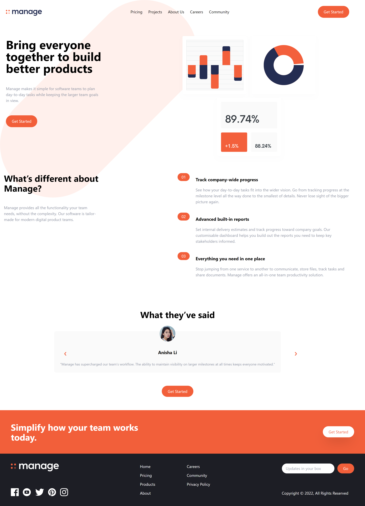
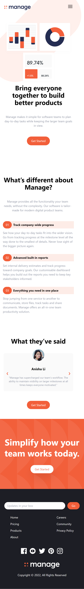
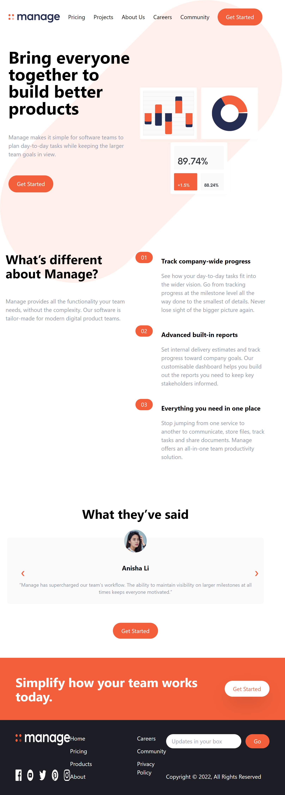

# Frontend Mentor - Manage landing page solution

This is a solution to the [Manage landing page challenge on Frontend Mentor](https://www.frontendmentor.io/challenges/manage-landing-page-SLXqC6P5). Frontend Mentor challenges help you improve your coding skills by building realistic projects. 

## Table of contents

- [Frontend Mentor - Manage landing page solution](#frontend-mentor---manage-landing-page-solution)
  - [Table of contents](#table-of-contents)
  - [Overview](#overview)
    - [The challenge](#the-challenge)
    - [Screenshot](#screenshot)
    - [Links](#links)
  - [My process](#my-process)
    - [Built with](#built-with)
    - [What I learned](#what-i-learned)
    - [Continued development](#continued-development)
    - [Useful resources](#useful-resources)
  - [Author](#author)
  - [Acknowledgments](#acknowledgments)

## Overview

### The challenge

Users should be able to:

- View the optimal layout for the site depending on their device's screen size
- See hover states for all interactive elements on the page
- See all testimonials in a horizontal slider
- Receive an error message when the newsletter sign up `form` is submitted if:
  - The `input` field is empty
  - The email address is not formatted correctly

### Screenshot

### Links

- Solution URL: [Solution URL](https://www.frontendmentor.io/solutions/responsive-landing-page-using-tailwind-ZiYMyyKPMh)
- Live Site URL: [Live site](https://managelandingronen.netlify.app/)

## My process

### Built with

- Semantic HTML5 markup
- Flexbox
- Mobile-first workflow
- [Tailwindcss](https://tailwindcss.com/) - CSS Framework
- JavaScript

### What I learned

Learnt the basic of Tailwindcss

### Continued development

I will like to focus more on learning Tailwind. 

### Useful resources

- [Example resource 1](https://www.youtube.com/watch?v=dFgzHOX84xQ&t=163s) - This helped me to get an introduction to Tailwindcss.
- [Example resource 2](https://www.w3schools.com/howto/howto_js_slideshow.asp) - This is an amazing article which helped me used vanilla JavaScript for creating a slideshow.

## Author

- Website - [Ronen Hammond](https://www.ronenhammond.me)
- Frontend Mentor - [@RonenTGreat](https://www.frontendmentor.io/profile/RonenTGreat)
- Twitter - [@Ronen_T_G](https://www.twitter.com/Ronen_T_G)
- LinkedIn - [Ronen Hammond](https://www.linkedin.com/in/ronen-hammond/)

## Acknowledgments

- Traversy Meida

- W3schools
